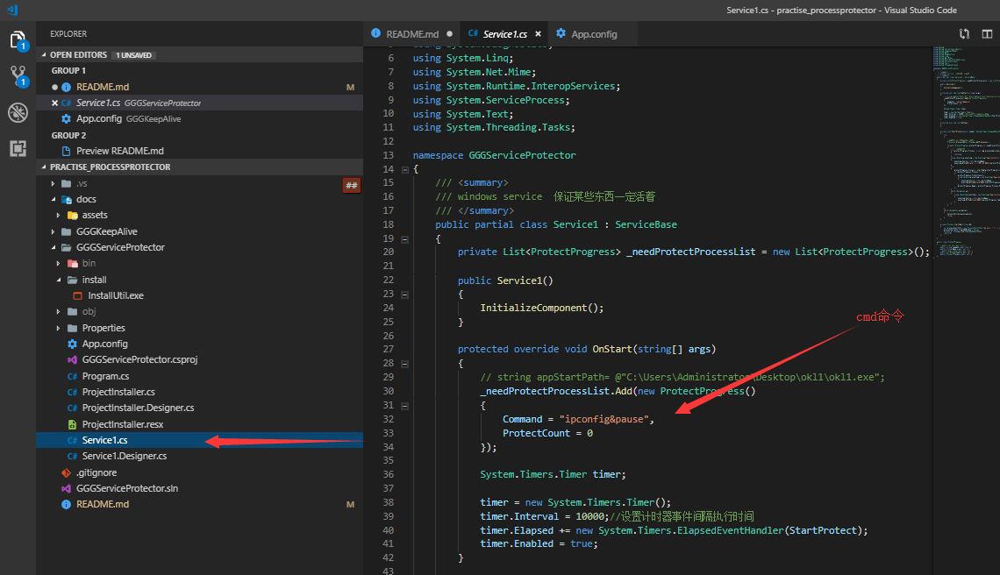
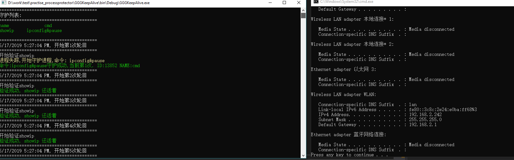

# practise_processprotector

进程守护,  让进程死而复活, 小强buff  (windows service版本,和控制台版本).

---

[TOC]

##知识点

 * [x] 如何取消控制台的quick edit mode (一选中就阻塞的问题)
 * [x] 如何取消控制台的键盘录入事件,如何禁止ctrl + c || esc 关闭控制台
 * [x] 满足上述需求的同时,如何减少cpu消耗
 * [x] 控制台timer 的 lock
 * [x] 控制台一次只运行一个
 * [x] service如何写入系统事件日志
 * [x] 了解Windows service不会出UI界面


## 如何使用
###GGGServiceProtector(windows service)
windows service 版本, 调试要去看windows event日志
#### 服务的安装卸载
[教程: https://docs.microsoft.com/en-us/dotnet/framework/windows-services/how-to-install-and-uninstall-services](https://docs.microsoft.com/en-us/dotnet/framework/windows-services/how-to-install-and-uninstall-services)
installutil.exe 在`./GGGServiceProtector/install`里

####配置

###GGGKeepAlive(console)
控制台版本, 先把这个弄成系统的定时任务,保证这个存活, 然后这个启动后会自动的去检查配置项目里需要启动的有没有启动,没有启动的就启动.
运行截图👇


####配置项目
``` xml
//App.config

<appSettings>
    <add key="interval" value="100" />  //检查间隔
    <add key="keep_showip" value="ipconfig&amp;pause" />  //检查项目可多个, keep_ 打头  value是需要执行的cmd命令 
  </appSettings>
```

<span style="color:red">注意</span>: value应当以`&amp;pause` (就是`&pause`命令)  结尾,不然会自动退出